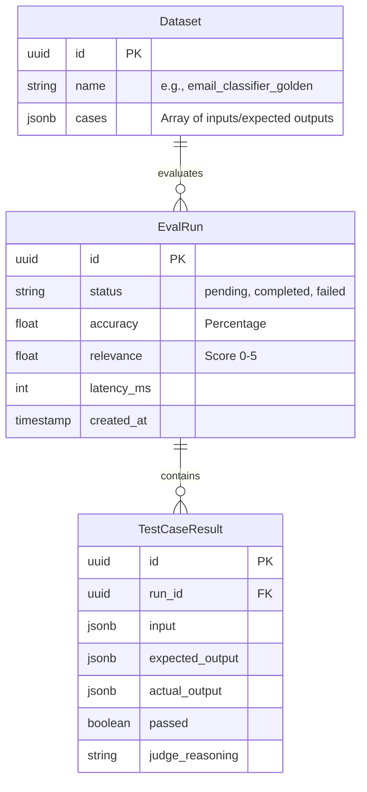

# Architecture & Systems Design

The Model Regression Detection System (MRDS) is an async-native Python microservice paired with a React Single Page Application (SPA). It is explicitly designed to handle high-concurrency evaluation workloads without triggering third-party API rate limits.

---

## 🏗 System Components

### 1. The FastAPI Backend (Core Engine)
Built on FastAPI for maximum asynchronous performance.
- **`EvalEngine`**: The orchestration layer. It receives a webhook, fetches the correct Golden Dataset from PostgreSQL, and constructs the batch of evaluation tasks.
- **`LLMRunner` (The Throttle)**: Because we might throw 5,000 test cases at OpenAI simultaneously, we wrap our outbound HTTP requests in an `asyncio.Semaphore`. This creates a bounded concurrency pool (e.g., 50 parallel requests), ensuring we never get `429 Too Many Requests` errors from our model providers.
- **`JudgeScorer`**: Implements the "LLM-as-a-Judge" pattern. It takes the output of the target model and feeds it to a superior model (like GPT-4) along with a grading rubric to determine a Relevance Score.

### 2. The Data Layer (PostgreSQL)
We leverage PostgreSQL with `asyncpg` for non-blocking I/O.

### 3. The React Frontend
A Vite-based SPA using TailwindCSS and Shadcn UI components. It communicates with the backend exclusively via RESTful APIs authenticated with HMAC/API Keys.

---

## 🔄 The Evaluation Lifecycle

```mermaid
sequenceDiagram
    autonumber
    participant GitHub as GitHub Actions
    participant API as FastAPI Router
    participant EE as EvalEngine
    participant DB as PostgreSQL
    participant LLM as External LLM API

    GitHub->>API: POST /webhook/pr (Webhook Trigger)
    API->>EE: trigger_run(dataset_id)
    EE->>DB: create_run(status='pending')
    EE->>DB: fetch_golden_dataset(dataset_id)
    
    rect rgb(15, 23, 42)
        Note over EE, LLM: Concurrent Execution Pool (Semaphore)
        EE->>LLM: execute_prompt(case_1)
        EE->>LLM: execute_prompt(case_2)
        LLM-->>EE: result_1
        LLM-->>EE: result_2
    end
    
    EE->>EE: JudgeScorer(results)
    EE->>DB: update_run(metrics, status='completed')
    API-->>GitHub: Post PR Comment with Markdown Diff
```

:::tip Why a Semaphore over a Queue?
We chose an `asyncio.Semaphore` over a dedicated message broker (like RabbitMQ or Celery) to keep the system decoupled and easily deployable via Docker, avoiding the infrastructure overhead of managing external workers.
:::
