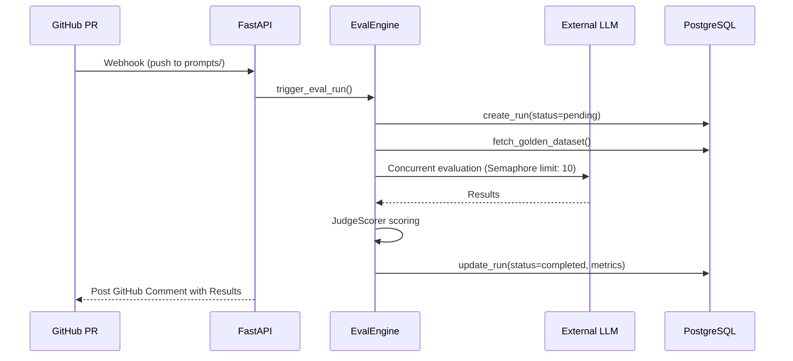

# Architecture

The Model Regression Detection System is a decoupled, async-native pipeline designed for high concurrency and robust failure handling.

## Component Overview

1. **Trigger Layer:**
   - **GitHub Webhooks:** Listens for `pull_request` events targeting specific paths (e.g., `prompts/`).
   - **Manual Triggers:** Executed via the React frontend.
2. **FastAPI Backend (Core):**
   - **API Routers:** Input validation via Pydantic.
   - **EvalEngine:** Orchestrates the evaluation pipeline.
   - **LLMRunner:** Highly concurrent `asyncio.Semaphore` based runner for executing against external LLMs without hitting rate limits.
   - **JudgeScorer:** Uses a powerful model (e.g., GPT-4o) to evaluate the outputs of a weaker/cheaper model (e.g., GPT-4o-mini).
   - **DiffEngine:** Compares current run metrics against baseline runs to calculate deltas.
3. **Data Layer (PostgreSQL):**
   - Uses `asyncpg` for non-blocking I/O.
   - Leverages `JSONB` to store flexible input/output schemas while maintaining strict relational integrity via UUID primary keys.

## Sequence Diagram

